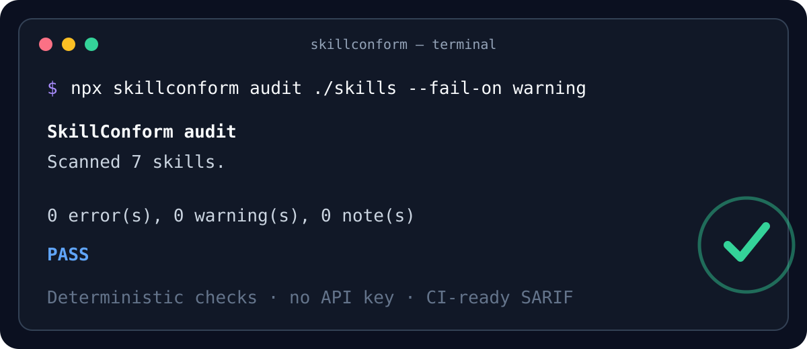

<p align="center">
  
</p>

<p align="center">
  <a href="https://github.com/GenRamzi/skillconform/actions/workflows/ci.yml"></a>
  <a href="https://www.npmjs.com/package/skillconform"></a>
  <a href="https://www.npmjs.com/package/skillconform"></a>
  <a href="LICENSE"></a>
  <a href="https://agentskills.io"></a>
</p>

**SkillConform is the open-source CI and test suite for Agent Skills: conformance, capability inventory, cross-agent compatibility evidence, deterministic security review, and regression testing.** It catches broken metadata, unsafe instructions, missing resources, embedded secrets, broad tool grants, and policy regressions before a skill reaches an agent.

Agent Skills are portable folders built around `SKILL.md`. The reference validator checks the core format; SkillConform adds a complementary quality layer for security review, workspace scanning, policy tests, CI, JSON, and SARIF.

<p align="center">
  
</p>

> Status: `v0.4.0` development line on `main`. The CLI, library API, and GitHub Action are ready for early adopters; published registry releases may lag `main`. Static compatibility and security results are evidence for review, not runtime certification.

## Quick start

Run without installing globally:

```bash
npx skillconform check ./my-skill
npx skillconform audit ./skills --fail-on warning
```

Generate machine-readable reports:

```bash
npx skillconform audit ./skills --format json -o skillconform.json
npx skillconform audit ./skills --format sarif -o skillconform.sarif
```

Inventory the capability surface before a skill is installed or published:

```bash
npx skillconform inventory ./skills
npx skillconform inventory ./skills --format json -o capabilities.json
```

The versioned `skillconform.capabilities/v1` document records declared tools, local references, bundled scripts, detected network hosts, shell/network signals, and portability notes. It is evidence for review and CI policy—not a claim that a skill is safe or compatible with every agent.

Compare the same skill against documented host constraints:

```bash
npx skillconform matrix ./skills
npx skillconform matrix ./skills --format json -o compatibility.json
```

The versioned `skillconform.compatibility/v1` matrix starts with Agent Skills, Claude Code, Claude API, OpenAI Skills, and Gemini CLI profiles. `PASS` means no static blocker was found, `REVIEW` means runtime/host evidence is still needed, and `UNSUPPORTED` means a documented constraint is contradicted. See [cross-agent compatibility profiles](docs/compatibility.md).

Gate a pull request against a baseline without executing target scripts:

```bash
npx skillconform regress ./candidate/skills --baseline ./baseline/skills
npx skillconform regress ./candidate/skills --baseline ./baseline/skills --fail-on warning
```

The versioned `skillconform.regression/v1` report detects newly introduced findings and trust-surface expansion such as network, shell, bundled scripts, tool permissions, and hosts. See [baseline-to-candidate regression](docs/regression.md).

For a guided walkthrough, follow the [five-minute demo](docs/quick-demo.md).

To run from source:

```bash
git clone https://github.com/GenRamzi/skillconform.git
cd skillconform
npm ci
npm run build
node dist/src/cli.js audit ./skills --fail-on warning
```

## Commands

| Command | Purpose |
|---|---|
| `check [path]` | Validate Agent Skills structure, metadata, naming, size, and references. |
| `audit [path]` | Run conformance checks plus deterministic security rules. |
| `inventory [path]` | Produce a deterministic capability/portability inventory. |
| `matrix [path]` | Compare static evidence with versioned host compatibility profiles. |
| `regress [candidate] --baseline <path>` | Compare a candidate tree against a baseline and gate trust-surface regressions. |
| `test [file]` | Execute regression expectations from `skillconform.yaml`. |
| `init [file]` | Create a starter policy-test configuration. |

Common options:

```text
--format pretty|json|sarif
--output, -o <file>
--fail-on error|warning|note|none
--quiet, -q
```

SkillConform returns exit code `0` when the selected threshold passes, `1` for policy findings, and `2` for invalid usage or configuration.

## What it detects

- Required `name` and `description` metadata.
- Agent Skills naming and directory-matching rules.
- Invalid field types and non-portable frontmatter.
- Missing or escaping local references.
- Oversized `SKILL.md` instructions that defeat progressive disclosure.
- Embedded API keys, GitHub tokens, AWS keys, and private keys.
- Destructive shell operations, download-to-shell pipelines, privilege escalation, and dynamic evaluation.
- Prompt-injection phrases that attempt to override host instructions or reveal system prompts.
- Broad pre-approved shell access.
- Undeclared network requirements.

See [the complete rule reference](docs/rules.md). Security findings are evidence for review, not a guarantee that a skill is safe.

## Regression policy

Create a configuration:

```bash
npx skillconform init
```

Then define expectations:

```yaml
version: 1
tests:
  - name: published skills remain clean
    path: skills
    mode: audit
    expect:
      errors: 0
      warningsAtMost: 0
      excludeRules:
        - SEC001
        - SEC002
```

Run it with:

```bash
npx skillconform test skillconform.yaml
```

## GitHub Action

```yaml
name: Agent Skill quality

on:
  pull_request:
  push:
    branches: [main]

permissions:
  contents: read

jobs:
  skillconform:
    runs-on: ubuntu-latest
    steps:
      - uses: actions/checkout@v7
      - uses: GenRamzi/skillconform@v0.1.1
        with:
          path: skills
          mode: audit
          fail-on: warning
```

Pin the action to a version tag or immutable commit SHA in maintained repositories.

## Library API

```ts
import { scanTarget, renderReport } from "skillconform";

const result = scanTarget("./skills", "audit");
process.stdout.write(renderReport(result, "json"));
```

## Design principles

- **Deterministic first:** the same files produce the same findings without an API key.
- **Portable:** core checks follow the open Agent Skills specification.
- **Reviewable:** every finding has a stable rule ID and a concrete remediation.
- **CI-native:** reports work in terminals, scripts, and SARIF consumers.
- **Least privilege:** security rules favor explicit tools, paths, and network requirements.

Read [the architecture](docs/architecture.md), [baseline-to-candidate regression](docs/regression.md), [cross-agent compatibility profiles](docs/compatibility.md), [SkillConform 2.0 direction](docs/skillconform-2.md), [roadmap](ROADMAP.md), and [contribution guide](CONTRIBUTING.md) before proposing larger changes.

## Community and launch resources

- Test the tool and report a sanitized real-world result in [the early-adopter feedback issue](https://github.com/GenRamzi/skillconform/issues/10).
- Use the [multi-channel launch kit](docs/launch-kit.md) for Show HN, Reddit, LinkedIn, X/Bluesky, and technical articles.
- Keep demonstrations reproducible and free of credentials, private skills, customer content, or unsupported security claims.

## Ecosystem, adoption, and partnerships

SkillConform is part of a two-project open-source stack. [Creative Agent Skills](https://github.com/GenRamzi/creative-agent-skills) provides reusable creative-production skills and audits its `skills/` directory with SkillConform in CI. This creates a public, reproducible integration rather than a standalone demo.

For the problem statement, target users, differentiators, measurable adoption milestones, partnership paths, and due-diligence links, read the [project brief](docs/project-brief.md).

The highest-value contributions now are independent integrations, minimized false-positive fixtures, missing-rule reports, compatibility tests, and public case studies.

## Scope and limitations

SkillConform performs static and policy analysis. It does not execute untrusted skill scripts, prove semantic correctness, replace sandboxing, or certify a skill as secure. Review skills before granting filesystem, shell, network, or external-service access.

## License

Apache License 2.0. See [LICENSE](LICENSE).
