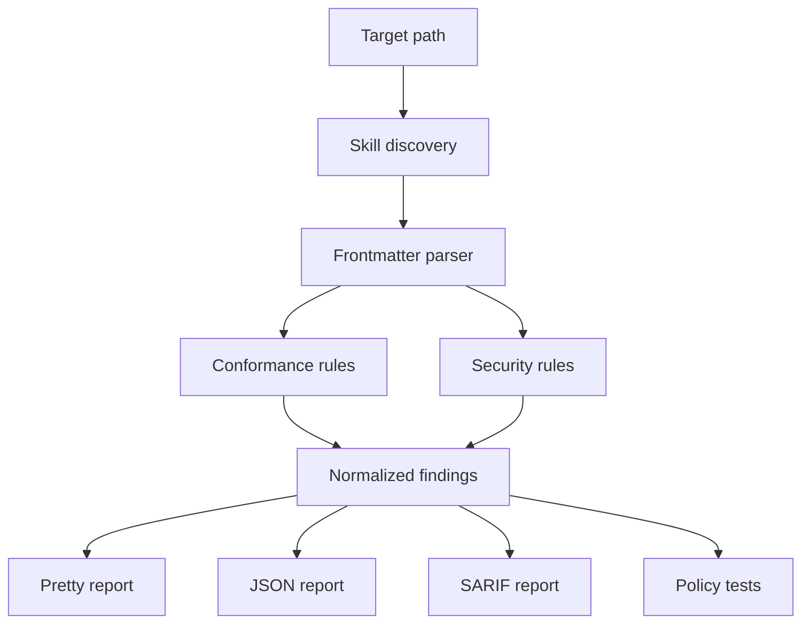

# Architecture

SkillConform separates discovery, parsing, rules, and reporting so clients can reuse the engine without invoking the CLI.

## Modules

| Module | Responsibility |
|---|---|
| `scanner.ts` | Discover skills and readable files while excluding build and dependency directories. |
| `frontmatter.ts` | Parse YAML frontmatter and preserve source context. |
| `rules.ts` | Produce deterministic conformance and security findings. |
| `reporters.ts` | Render terminal, JSON, and SARIF output. |
| `policy-tests.ts` | Compare scan results with repository-owned expectations. |
| `cli.ts` | Parse commands, select modes, write output, and set exit codes. |

## Trust boundary

The scanner reads text files but never runs scripts from the target skill. This is a deliberate security boundary. Future dynamic evaluation must remain opt-in, isolated, and visibly separate from deterministic static analysis.

## Adding a rule

1. Assign the next stable ID in the correct namespace.
2. Emit a normalized finding with a remediation.
3. Add positive and negative fixtures.
4. Document the rule in `docs/rules.md`.
5. Add a policy-test expectation when the rule protects a project invariant.
